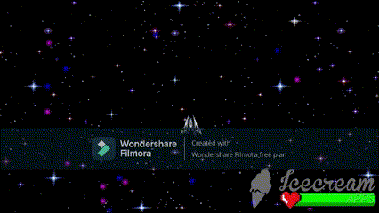

# The-Adventure-Space-Invaders-
Este fue uno de los primero juegos que cree en Unity con C#. Es un plagio de uno de los juegos clasicos ya conocidos (Space Invaders) pero con mi toque personal

# Proyecto Unity - Versión Construida

Este repositorio contiene **únicamente** la versión final construida del juego y **no** el código fuente ni los recursos utilizados para desarrollarlo.

### ¿Qué significa "versión construida"?
La versión construida es el resultado final después de compilar y empaquetar el juego en Unity. Esto incluye todos los archivos necesarios para ejecutar el juego en la plataforma de destino (por ejemplo, `.exe` para Windows, `.app` para macOS, etc.), pero no contiene el código fuente, scripts, escenas, ni otros recursos de desarrollo.

### ¿Por qué no está incluido el código fuente?
El propósito de este repositorio es distribuir la versión ejecutable del juego. Si estás buscando el código fuente no es posible, puesto que perdi la mayoria de mis trabajos debidos a un error de mi ordenador y solo tengo los trabajos subidos a mi google Drive.

